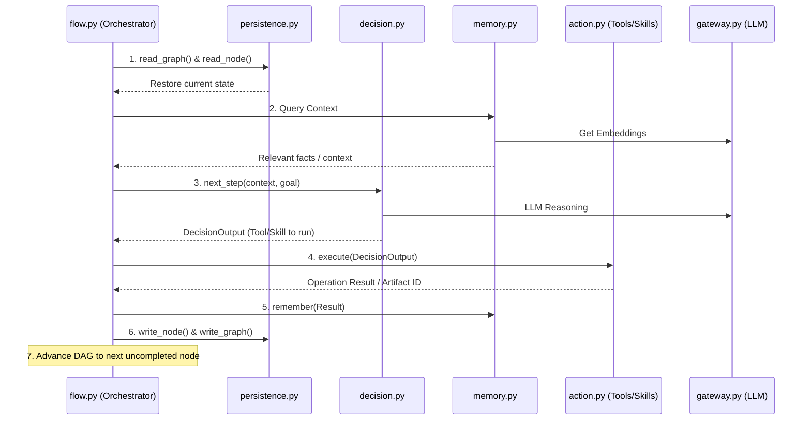

# Multi Agent DAG Orchestration and Skill Catalogs

Multi-agent growing-graph orchestrator built on the Session 7 cognitive
architecture. The graph itself is the agent loop: each node is a typed
skill (Planner, Researcher, Distiller, Critic, Formatter, …), edges
carry the predecessor's `AgentResult`, and the runtime executes ready
nodes in parallel via `asyncio.gather`.

Your assignment is to ship one missing skill (the **Coder**) so the
agent can write code, run it in a subprocess sandbox, and feed the
result back through the graph. 

---

## Layout

```
S8SharedCode/
├── README.md          ← you are here
├── ASSIGNMENT.md      ← what you implement, how it gets graded
├── .env.example       ← copy to .env, fill in keys you have
├── .gitignore
│
├── code/              ← the agent. Run from here.
│   ├── flow.py        ← orchestrator (Graph + Executor + CLI). Read this first.
│   ├── skills.py      ← skill registry, prompt rendering, run_skill
│   ├── recovery.py    ← failure classification + critic-fail splice
│   ├── persistence.py ← session writes (graph.json + per-node JSON)
│   ├── mcp_runner.py  ← multi-turn tool-use loop wrapper
│   ├── sandbox.py     ← subprocess Python runner (usability boundary; NOT security)
│   ├── replay.py      ← stdin-driven trace viewer
│   ├── schemas.py     ← AgentResult, NodeSpec, NodeState, MemoryItem, …
│   ├── agent_config.yaml  ← skills catalogue (this is where you confirm Coder wiring)
│   ├── prompts/       ← one .md per skill. You edit coder.md.
│   ├── tests/         ← starts with test_recovery.py; you add yours.
│   ├── mcp_server.py  ← MCP tools: web_search, fetch_url, search_knowledge, …
│   ├── memory.py / vector_index.py / artifacts.py  ← S7 carryover (don't touch)
│   ├── perception.py / decision.py / action.py     ← S7 carryover (don't touch)
│   └── sandbox/papers/  ← five arxiv abstracts for indexed-corpus queries
│
└── gateway/           ← LLM Gateway V8 (FastAPI). Runs on :8108.
    ├── main.py
    ├── client.py      ← the SDK code/gateway.py imports from
    ├── providers.py / router.py / embedders.py / db.py / cache.py
    ├── agent_routing.yaml  ← agent → preferred provider mapping
    ├── pyproject.toml
    └── run.sh
```

---

## Quickstart

You need: Python 3.11+, [uv](https://docs.astral.sh/uv/), Ollama
(`brew install ollama` then `ollama pull nomic-embed-text`), and at least
one provider API key from `.env.example`.

```bash
# 1. Secrets
cp .env.example .env
$EDITOR .env                  # add the keys you have

# 2. Install
cd gateway && uv sync && cd ..
cd code    && uv sync && cd ..

# 3. Start the gateway (one terminal)
cd gateway && uv run main.py
# (or: ./run.sh)
# It boots on http://localhost:8108; /v1/routers should answer.

# 4. Run the agent (another terminal)
cd code
uv run python flow.py "hello"
```

A successful first run prints two node lines (planner, formatter) and a
greeting. Sessions land in `code/state/sessions/<sid>/`. Walk one with:

```bash
uv run python replay.py <sid>
```

---

## How to think about the architecture

The Planner reads the user query and emits a small DAG of skill nodes
to run. Each ready node fires through the gateway in parallel with its
ready siblings. When a skill's yaml entry has `internal_successors`,
the orchestrator appends those automatically — that's how **Coder →
SandboxExecutor** chains without the Planner having to ask for it.

Critic nodes get auto-inserted on edges out of skills tagged
`critic: true` in `agent_config.yaml` (currently Distiller). A
verdict=fail from a Critic splices a recovery Planner into the graph,
capped at one re-plan per branch.

Failure handling is in `recovery.py`. Transient gateway errors don't
re-plan (the gateway already retries); validation errors don't re-plan
(it's a prompt bug); upstream-failures do. `tests/test_recovery.py`
pins the classifier against the actual gateway error strings.

Read `flow.py`'s 300 lines top-to-bottom before you write a single
line of your Coder prompt. The orchestrator is small enough to fit in
your head.

---

## When things go wrong

| symptom | first place to look |
|---|---|
| `[gateway] launching … failed to start within 45s` | `cd gateway && uv run main.py` in another terminal; read its stderr. Probably a missing API key or port :8108 already taken. |
| `httpx.HTTPStatusError: '503 Service Unavailable'` | All worker providers in cooldown / unconfigured. Add another key to `.env` or wait a minute. |
| coder ran but `sandbox_executor` reports `no code in upstream coder output` | Your prompt isn't emitting the JSON shape the orchestrator expects. See ASSIGNMENT.md §"Output contract". |
| The final answer is short / wrong | Run `replay.py <sid>` and inspect what each node actually saw (the `prompt_sent` field captures the exact bytes sent to the gateway). |

---

## What NOT to touch

- `agent7_s7_carryover.py` (if present) — the Session 7 single-loop agent kept for reference. Out of scope.
- `perception.py`, `decision.py`, `action.py`, `memory.py`,
  `vector_index.py`, `artifacts.py`, `mcp_server.py` — carry over
  byte-identical from Session 7. The tool-blindness contract on
  Perception depends on these staying as-is.
- `gateway/` — treat as a service you call. If you find a real bug,
  open an issue; do not patch it inside your assignment.

---

## Provenance and version

This package is the Session 8 build that passes the round-3 review.
22 unit tests cover the failure-recovery + critic-splice mechanics.
Five validation queries (hello, S7 carryover Shannon, parallel fan-out
populations, graceful-fail nonexistent path, SIGKILL+resume) have been
verified end-to-end on the same code you have here.

If your `uv run python flow.py "hello"` produces a final answer, the
build runs cleanly on your machine. The next step is ASSIGNMENT.md.

---

# Project Architecture and Execution Flow

This document outlines how the various modules in the repository stitch together to form the Multi-Agent DAG Orchestrator. 

## High-Level Execution Loop

The system operates as an autonomous event loop driven by a Directed Acyclic Graph (DAG). The general flow of a single loop iteration is:

1. **State Recovery & Persistence (`persistence.py`)** 
   Upon startup or resumption, the system reads the saved Graph and Node states from disk to determine where it left off.
2. **Perception & Context (`memory.py`, `perception.py`)** 
   The agent gathers context. The memory module queries local knowledge bases (`vector_index.py`) and passes historical context to the decision engine.
3. **Reasoning (`decision.py`)** 
   The engine evaluates the current goal against the gathered context, available tools, and artifacts to figure out the next logical step.
4. **Action & Skill Execution (`action.py`, `skills.py`)** 
   The chosen operation is executed. This could be a static python execution in a sandbox environment (`sandbox.py`), an LLM-driven prompt (`gateway.py`), or a tool call (`mcp_server.py`).
5. **Observation & Artifact storage (`artifacts.py`)** 
   Bulky output data is stripped from the prompt window and stored directly into artifacts. A lightweight reference is passed back.
6. **State Mutation & Orchestration (`flow.py`)** 
   The result is wrapped into a new Node in the Graph. The graph transitions to the next state, writes back to disk, and loops until the terminal node evaluates the task as complete.

## Component Interaction Map



## Core Modules breakdown

### 1. The Brain: `decision.py` & `gateway.py`
The Gateway establishes a uniform connection to LLM providers (retrying and routing dynamically). The Decision module builds the orchestration prompts and orchestrates token-bound context limits before hitting the Gateway.

### 2. The Muscle: `action.py`, `skills.py`, & `mcp_runner.py`
These modules are responsible for physically interacting with the world. Skills are predefined agent patterns, while Actions encompass raw tool calls (like reading local files or searching the web).

### 3. The Nervous System: `flow.py` & `recovery.py`
Flow builds, runs, and traverses the DAG (`nx.DiGraph`). When `Action` steps fail, `recovery.py` runs classification on the error to decide if the orchestrator should immediately retry, skip, or formulate a new path.

### 4. The Short & Long-Term Storage: `persistence.py`, `artifacts.py`, & `memory.py`
- **Persistence:** Local JSON representations of the DAG and Nodes. Used strictly for orchestration tracking and crash-recovery.
- **Artifacts:** Blob storage for arbitrary data (large text, images) so the LLM context window doesn't overflow.
- **Memory/Vectors:** FAISS (`vector_index.py`) powered contextual storage to bring older facts back into the active context.

### Queries
Query A. Shannon Wikipedia (artifact attach, carryover)
uv run python flow.py "Fetch https://en.wikipedia.org/wiki/Claude_Shannon and tell me his
birth date, death date, and three key contributions to information
theory." > QueryA.txt 2>&1


Query B. Tokyo activities and weather (multi-goal, memory carryover, carryover)

uv run python flow.py "Find 3 family-friendly things to do in Tokyo this weekend.
Check Saturday's weather forecast there and tell me which one
is most appropriate."  > QueryB.txt 2>&1

Query C. Mom's birthday (durable memory across runs, carryover)

Run 1: uv run python flow.py "My mom's birthday is 15 May 2026. Remember that and create reminders for two weeks before and on the day." > QueryC1.txt 2>&1
Run 2: uv run python flow.py "When is mom's birthday?" > QueryC2.txt 2>&1


Query D. Asyncio research (multi-source synthesis, carryover)

uv run python flow.py "Search for 'Python asyncio best practices', read the top 3 results, and give me a short numbered list of the advice they agree on."  > QueryD.txt 2>&1    


Query E. Single-document index and extract

uv run python flow.py "Index the file papers/attention.md and tell me what the three key contributions of the Transformer architecture are according to this paper." > QueryE.txt 2>&1


Query F. Cross-run document recall (FAISS persistence)

Run 1: uv run python flow.py "Index every .md file under papers/. Confirm how many chunks
       were indexed in total." > QueryF1.txt 2>&1
Run 2 (fresh process, persisted state):
       uv run python flow.py "Across the papers I have indexed, what do they say about chain-of-thought reasoning?" > QueryF2.txt 2>&1

Query G. Synonym recall (vector beats keyword)

uv run python flow.py "Across these papers, how do they handle the credit assignment
problem?" > QueryG.txt 2>&1

Query H. Cross-document synthesis

uv run python flow.py "Compare how the ReAct paper and the Chain-of-Thought paper differ
in their treatment of intermediate reasoning."  > QueryH.txt 2>&1 

Query I. Three city populations (the parallel-fan-out case)

uv run python flow.py "Find the populations of London, Paris, Berlin and tell me which two are
closest in size."  > QueryI.txt 2>&1 

Query J. Graceful failure

uv run python flow.py "Read /nonexistent/path.txt and tell me what's in it."  > QueryJ.txt 2>&1 


### Stage 2
Design one query that requires parallel fan-out. The query must have at least three independent sub-tasks that the Planner correctly emits as concurrent nodes. Verify that the parallel layer's wall-clock is the maximum of the branches, not the sum.

uv run python flow.py "Search the web for each of these separately: (1) what language is Python's asyncio event loop written in, (2) what year was NetworkX first released, (3) what does the acronym FAISS stand for. Combine all three answers."

### Stage 3 
Design one query that requires a Critic verdict. Choose a property the Critic can actually verify with the tools available to it. The Critic must produce both a pass and a fail across two runs of the query, and the fail must successfully splice in a Planner recovery that produces a corrected answer.

uv run python flow.py "Search the web for the current CEO of Microsoft and write a summary of their name that is exactly 4 words. Use a critic to enforce the word count constraint."

### Stage 4
Fill in the Coder skill. The current prompts/coder.md is a stub; replace it with a prompt that emits Python suitable for the SandboxExecutor. Demonstrate the Coder on one query where the answer requires computation the Formatter cannot reliably produce from text alone.

uv run python flow.py "Calculate the exact number of words that are exactly 7 characters long in the paper papers/lora.md. You must write a Python script using the Coder skill to do this calculation, rather than estimating."

### Stage 5
Add one new skill to agent_config.yaml. Choose a skill that the existing catalogue does not cover. Write its prompt file. Write one query that exercises it. The orchestrator should not need modification; if it does, the modification is reportable.

Skill added : comparator.md in prompts/
Updated files : planner.md in prompts/ and agent_config.yaml

uv run python flow.py "Compare the papers papers/cot.md and papers/react.md. Specifically create a comparison table comparing their main objectives, the benchmarks they evaluate on, and their core methodology. Use the comparator skill to generate the comparison matrix."


https://youtu.be/j3-em7YxstA

